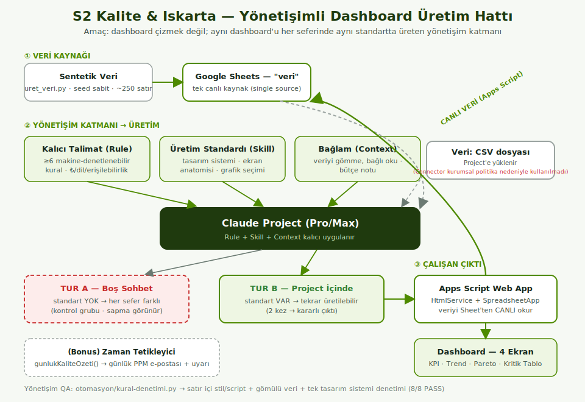
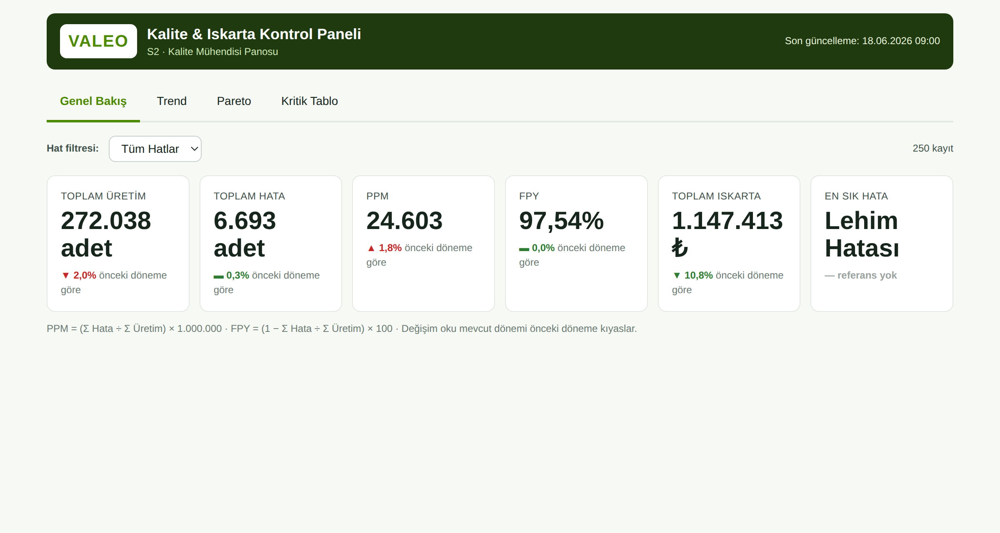
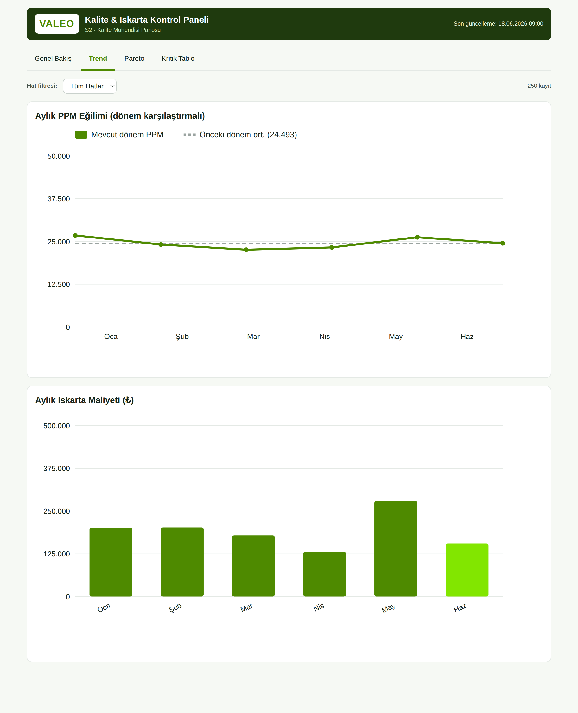
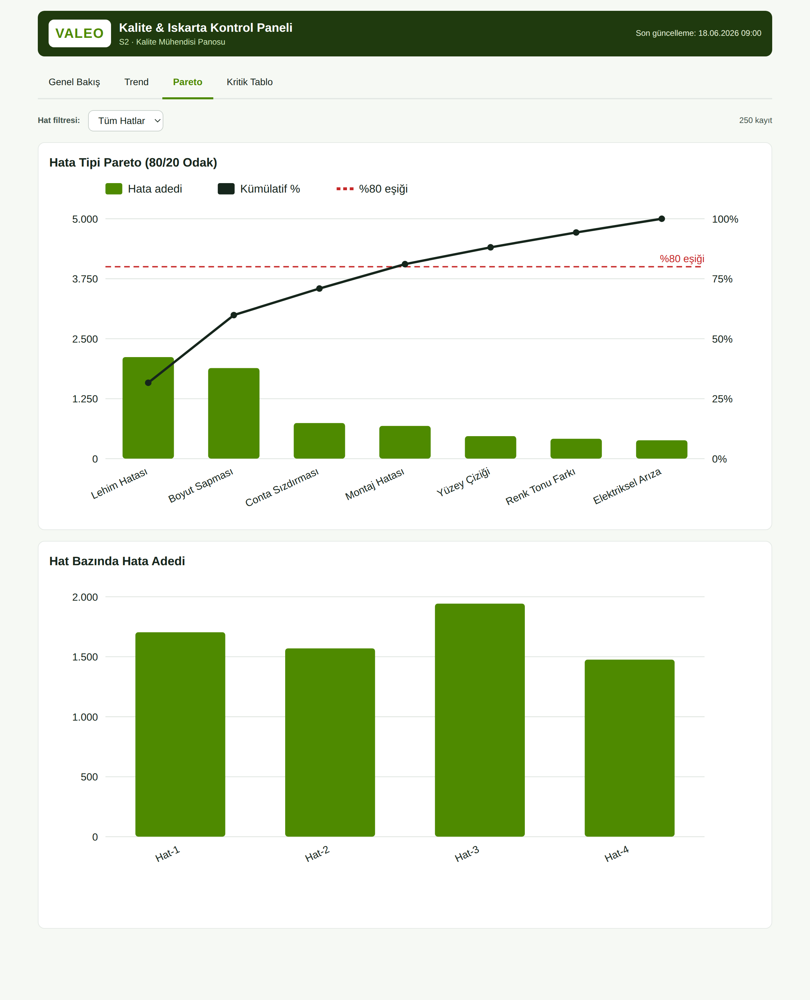
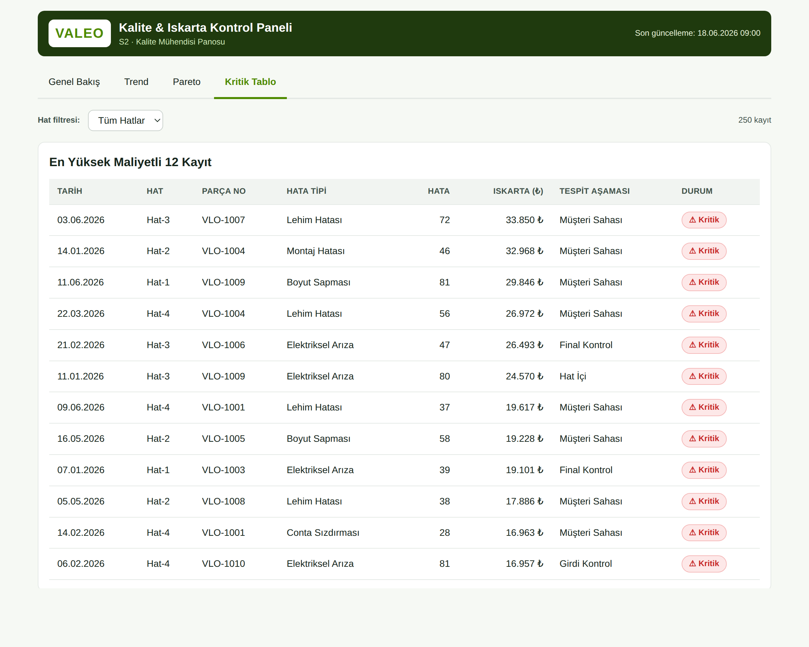

# VALEO · Kalite & Iskarta Takibi — Proje Raporu (Bölüm 8)

**Ad Soyad:** Alpay Mutlu · **Departman:** Ar-Ge / Kalite · **Araç:** Claude (Pro/Max) · **Senaryo:** S2 · **Tarih:** 18.06.2026

> Bu Markdown, rapor.pdf ile aynı içeriğin GitHub'da okunabilir halidir (kaynak: rapor/rapor_uret.py).

## 1. Senaryo ve Persona

Senaryo: S2 — Kalite & Iskarta Takibi. Persona: bir VALEO üretim tesisinde çalışan Kalite Mühendisi. Amaç, kalite/ıskarta verisinden yönetici düzeyinde, tek ekranda okunan bir kontrol paneli üretmek; ama asıl hedef bu paneli her seferinde aynı standartta üreten bir yönetişim katmanı kurmaktır.

Panonun yanıtladığı üç karar sorusu:

- Hangi hata tipleri toplam hatanın/ıskartanın çoğunu üretiyor? (Pareto · 80/20 odak)
- PPM ve ıskarta maliyeti dönemler arasında nasıl değişiyor? (trend, mevcut vs önceki dönem)
- En yüksek maliyetli/kritik kayıtlar hangileri ve hangi tespit aşamasında yakalanıyor? (geç tespit = pahalı)

## 2. Yönetişim Mimarisi

Çözüm üç katmandan oluşur: (1) tek canlı veri kaynağı, (2) yönetişim + üretim katmanı, (3) çalışan çıktı. Yönetişim üç parçayla sağlanır: Kalıcı Talimat (Rule), Üretim Standardı (Skill) ve Bağlam (Context) yönetimi. Bunlar Claude Project'e kalıcı yüklenir; böylece her sohbette otomatik uygulanır.

Şekil 1. Yönetişimli üretim hattı. Sentetik veri Google Sheets'e aktarılır (tek kaynak). Claude, Connector ile bu Sheet'i canlı okur ve Rule+Skill+Context kuralları altında Apps Script dashboard kodunu üretir. Dashboard, web app olarak yayınlanır ve veriyi yine aynı Sheet'ten SpreadsheetApp ile canlı okur. Yüksek çözünürlüklü hali: rapor/mimari-diyagram.svg.

Rule (kalici-talimat.md): ≥6 makine-denetlenebilir kural — para ₺ + tr-TR binlik, tüm etiketler Türkçe, veri koda gömülmez (bağlı kaynaktan okunur), satır içi stil/script yok, WCAG AA + renk tek başına anlam taşımaz, her ekranda boş/hata/yüklenme durumu, tarih GG.AA.YYYY. Skill (uretim-standardi.md): tasarım sistemi (VALEO paleti, tipografi, boşluk), ekran anatomisi, grafik seçim rehberi, metrik tanımları. Context: veriyi sohbete gömmek yerine bağlı okutmak, standardı tek seferlik dosya olarak yüklemek.

## 3. Bağlam (Context) Yönetimi

Bağlam bütçesi şu ilkelerle yönetildi:

- Veri sohbete kopyalanmadı; Connector ile bağlı Google Sheet'ten canlı okutuldu. Böylece 250 satır ham veri her istekte bağlamı şişirmedi ve veri değişince tek istekle güncellendi.
- Rule ve Skill, her mesajda tekrarlanmak yerine Project'e bir kez yüklendi (kalıcı bağlam).
- Standart, uzun açıklama yerine kısa ve denetlenebilir kurallar olarak yazıldı (düşük token, yüksek belirlilik).
- Dashboard kodu veriyi gömmediği için çıktı sabit boyutlu kaldı; veri büyüse de kod büyümez.

## 4. Tur A ve Tur B Karşılaştırması

Aynı istek iki ortamda denendi. Tur A: yönetişim olmayan boş sohbet (kontrol grubu). Tur B: Rule+Skill+Context yüklü Project. Her tur 2 kez tekrarlandı.

| Boyut | Tur A — Boş Sohbet | Tur B — Project (Yönetişimli) |
| --- | --- | --- |
| Tekrar kararlılığı | Her denemede farklı yapı/renk/dil | İki denemede de aynı 4 ekran ve stil |
| Para/dil | Bazen $, İngilizce etiketler | Her zaman ₺ + tr-TR + Türkçe |
| Veri kaynağı | Veriyi koda gömme eğilimi | Bağlı Sheet'ten canlı okuma |
| Durumlar | Boş/hata durumu çoğu kez yok | Yükleniyor/boş/hata her ekranda |
| Erişilebilirlik | Renk tek sinyal | Etiket + ikon + AA kontrast |

Sonuç: yönetişim katmanı, çıktının kalitesini kişisel/şans faktöründen kurala taşıdı; tekrar üretilebilirlik Tur B'de net biçimde sağlandı.

## 5. En Etkili Promptlar

Aşağıdaki promptların tam metinleri transcripts/ klasöründe yer alır; en etkili olanlar:

- Tur B üretim: "Bağlı Sheet'teki 'veri' sayfasını canlı oku; veriyi koda gömme. Üretim standardındaki tasarım sistemine ve kalıcı talimattaki kurallara birebir uyarak Apps Script web app dashboard'unu (Kod.gs + index + stil + script) üret."
- Kararlılık testi: "Aynı isteği tekrar uygula; çıktının önceki üretimle ekran, stil ve metrik tanımı açısından aynı olduğunu doğrula, farkları listele."
- Kural ihlali denemesi: "KPI'ları $ ile ve İngilizce göster" → beklenen: Claude kuralı hatırlatıp ₺ + Türkçe'de ısrar eder (yönetişim çalışıyor).
- Canlı veri: "Sheet'te bir hücreyi değiştirdim; dashboard'u yeniden üret / web app'i yenile, değerlerin güncellendiğini göster."

## 6. Engeller ve Çözümler

- Engel: Apps Script HtmlService statik .css/.js servis edemez. Çözüm: CSS/JS tek kaynakta (kaynak/) tutulup include ile tek stil + tek script partial'ına derlenir (derle_appsscript.py); 'tek tasarım sistemi' kuralının ruhu korunur.
- Engel: Apps Script IFRAME sandbox'ta dış CDN (grafik kütüphanesi) riski. Çözüm: grafikler elle SVG ile çizildi; dış bağımlılık yok, çevrimdışı çalışır.
- Engel: Drive'daki VALEO logosunda public paylaşım/CSP/hotlink sorunu. Çözüm: logo sunucuda DriveApp ile okunup base64 data-URI olarak döndürülür; yüklenmezse 'VALEO' yazı-marka fallback.
- Engel: boş sohbette çıktı sapması. Çözüm: Rule+Skill yüklü Project + otomatik kural denetimi (otomasyon/kural-denetimi.py) ile tekrar üretilebilirlik.

## 7. Öz-Değerlendirme

Rubrik kontrol listesi (kendi değerlendirmem):

| Kriter | Durum |
| --- | --- |
| Bağlam + Rule (kalıcı talimat) | Tamam — ≥6 denetlenebilir kural, Project'e yüklü |
| Skill / Üretim standardı | Tamam — tasarım sistemi + ekran anatomisi + grafik seçimi |
| Canlı veri (Connector + Apps Script) | Tamam — Sheet canlı okunur, veri gömülmez |
| Context yönetimi | Tamam — bağlı okuma + tek seferlik standart yükleme |
| İki tur (A boş / B project) | Tamam — 2'şer tekrar, kararlılık gösterildi |
| Dashboard (4 ekran, kurallara uygun) | Tamam — KPI/Trend/Pareto/Tablo + durumlar |
| Bonus otomasyon | Tamam — günlük PPM e-posta tetikleyicisi (Apps Script) |

Geliştirme alanı: Şu an dönem ayrımı veriyi tarih ortasından ikiye bölüyor; ileride kullanıcı seçilebilir tarih aralığı (örn. son 30 gün vs önceki 30 gün) ve hat bazlı PPM hedef çizgileri eklenebilir. Ayrıca erişilebilirlik için grafiklere ekran okuyucu dostu veri tablosu alternatifi konabilir.

## 8. Doğrulama ve Kanıt

Altı doğrulama senaryosu transcripts/dogrulama.md içinde adım adım yer alır: (1) tekrar üretilebilirlik, (2) boş/bozuk veri, (3) kural ihlali denemesi, (4) standardın uygulanışı, (5) canlı veri değişikliği, (6) bağlam bütçesi. Yönetişim QA betiği (otomasyon/kural-denetimi.py) satır içi stil/script ve gömülü veri denetimini 8/8 PASS ile geçer (otomasyon/kanit-log.txt).

## 9. Ekran Görüntüleri ve Kanıt

Aşağıda dashboard'un dört ekranının gerçek görüntüleri yer alır. claude.ai (Project/Rule/Skill), Connector, iki tur, canlı veri ve tetikleyici kanıtları gerçek oturumlardan eklenir; ilgili PNG'ler ekran-goruntuleri/ klasörüne konup rapor yeniden üretildiğinde otomatik olarak buraya gömülür.

### Dashboard ekranları

**E1 — Genel Bakış (6 KPI: Üretim, Hata, PPM, FPY, Iskarta ₺, En Sık Hata)**

**E2 — Trend (aylık PPM + önceki dönem referansı; aylık ıskarta maliyeti)**

**E3 — Pareto (hata tipleri 80/20 + hat bazında kırılım)**

**E4 — Kritik Tablo (en yüksek maliyetli kayıtlar + durum rozetleri)**

### Süreç ve kanıt görüntüleri (gerçek oturumlardan eklenecek)

**Project — Kalıcı Talimat (Rule) yüklü** — _eklenecek: `ekran-goruntuleri/project-rule.png`_

**Project — Üretim Standardı (Skill) yüklü** — _eklenecek: `ekran-goruntuleri/project-skill.png`_

**Connector — Google Sheets bağlı** — _eklenecek: `ekran-goruntuleri/connector-bagli.png`_

**Tur A — boş sohbet, 1. deneme** — _eklenecek: `ekran-goruntuleri/turA-deneme1.png`_

**Tur A — boş sohbet, 2. deneme** — _eklenecek: `ekran-goruntuleri/turA-deneme2.png`_

**Tur B — Project içinde üretim, 1. deneme** — _eklenecek: `ekran-goruntuleri/turB-uretim1.png`_

**Tur B — kararlılık, 2. deneme** — _eklenecek: `ekran-goruntuleri/turB-uretim2.png`_

**Canlı veri — değişiklik öncesi** — _eklenecek: `ekran-goruntuleri/dogrulama-canli-once.png`_

**Canlı veri — değişiklik sonrası** — _eklenecek: `ekran-goruntuleri/dogrulama-canli-sonra.png`_

**Bonus — tetikleyici çalıştırma günlüğü** — _eklenecek: `ekran-goruntuleri/tetikleyici-log.png`_

**Bonus — günlük kalite özeti e-postası** — _eklenecek: `ekran-goruntuleri/tetikleyici-eposta.png`_
